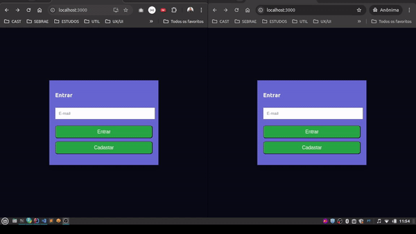

# Salas Webchats Realtime

> Este projeto é a implementação do backend de um aplicativo web para criação e utilização de salas com webchats com atualizações em realtime utilizando WebSockets.
>
> Para rodar o projeto completamente, é necessário utilizar o projeto frontend disponível neste link: [`frontend`](https://github.com/samuelJunnior/webchat-frontend)

**Sumário**
- [Preview](#-preview)
- [Tecnologias](#-tecnologias)
  - [Ambiente](#ambiente)
  - [Desenvolvimento](#desenvolvimento)
- [Pré-requisitos](#-pr-requisitos)
- [Build e Execução local](#-build-e-execucao-local)
- [Usando a API](#-usando-a-api)
- [Colaboradores](#-colaboradores)
- [Contribuição](#-contribuição)

## Preview


*[Video completo](https://vimeo.com/1018047598) que mostra a interface do usuário e a funcionalidade de mensagens em tempo real.*

## 💻 Tecnologias

### Ambiente
* Java 21
* Maven
* Docker

### Desenvolvimento
* Spring Boot
* Versionamento e hospedagem de código com `Git` / [`Github`](https://github.com/samuelJunnior/webchat-backend)
* Banco de dados relacional `Postgres`
* Banco de dados NoSQL `MongoDB`
* Produtividade com `Lombok` e `MapStruct`
* `ControllerAdvice` & `Problem Details` para tratamento de `exceptions`
* Documentação com `OpenApi/Swagger`
* Comunicação bidirecional cliente-servidor com `Spring Boot Starter WebSocket`
* `Paginação e Ordenação` utilizando a API do Spring Data

## 💻 Pré-requisitos

* Você precisa ter o Java instalado e configurado.
* Você precisa ter o Docker instalado e configurado.
* Você precisa ter o Maven instalado e configurado.

Para executar as soluções em ambiente `localhost`, pode ser interessante ter instâncias de banco de dados localmente.

Caso já tenha sua instância de banco configurada, apenas ajuste as configurações de `datasource` e URL do MongoDB no arquivo [`application.yaml`](/src/main/resources/application.yaml).

Caso não tenha, execute o arquivo `docker-compose.yml` dentro do diretório [deployments](/deployments/docker-compose.yml) com o comando:
```bash
docker compose up -d
```
Serão criados os containers para utilização do banco postgres, mongodb e mongo-express.


## 🚀 Build e Execução local

Para gerar a versão executável do projeto com a extensão .jar é necessário executar o comando abaixo no diretório raiz:
```bash
mvn clean package
```

Execute o comando abaixo para iniciar o projeto
```bash
java -jar target\nome-do-seu-projeto.jar
```

## ☕ Usando a API

>Após a inicialização do projeto, acessar pelo endereço:
[http://localhost:8080/swagger-ui.html](http://localhost:8080/swagger-ui.html)

## 🤝 Colaboradores

Agradecemos às seguintes pessoas que contribuíram para este projeto (contém ironia):

<table>
  <tr>
    <td align="center">
      <a href="#">
         <br>
        <sub>
          <b>Samuel Junior</b>
        </sub>
      </a>
    </td>
    <td align="center">
      <a href="#">
        <br>
        <sub>
          <b>Mark Zuckerberg</b>
        </sub>
      </a>
    </td>
    <td align="center">
      <a href="#">
        <br>
        <sub>
          <b>Steve Jobs</b>
        </sub>
      </a>
    </td>
  </tr>
</table>
